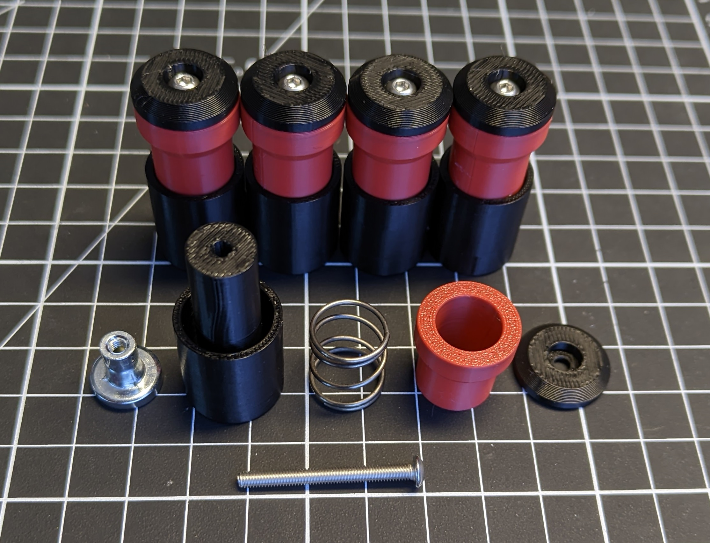
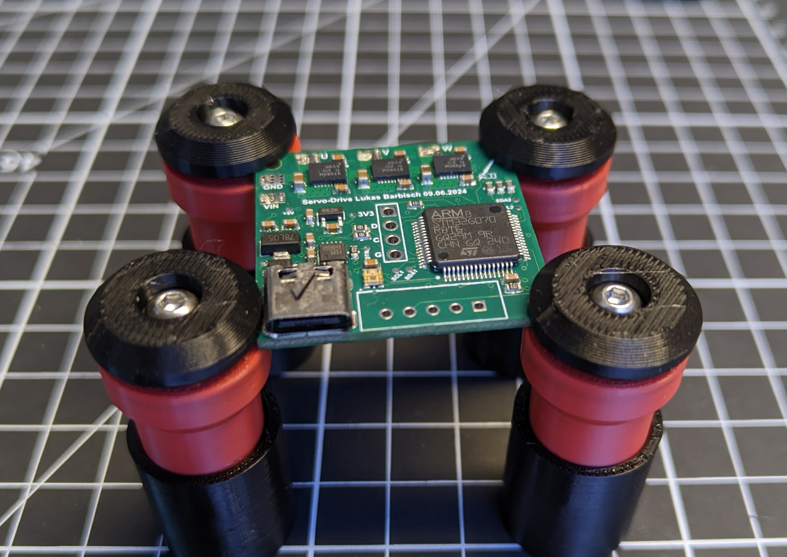

Recreation of the Sensepeek PCBite circuit board holders.  
Parts used are:
- 3d printed base, slider and top
- M3-1312 magnet base with internal threads
- spring (OD: 14mm, height; 16mm, wire: 1mm)
- M3x30 BHCS screw

  

  
License: CC BY-NC 4.0
